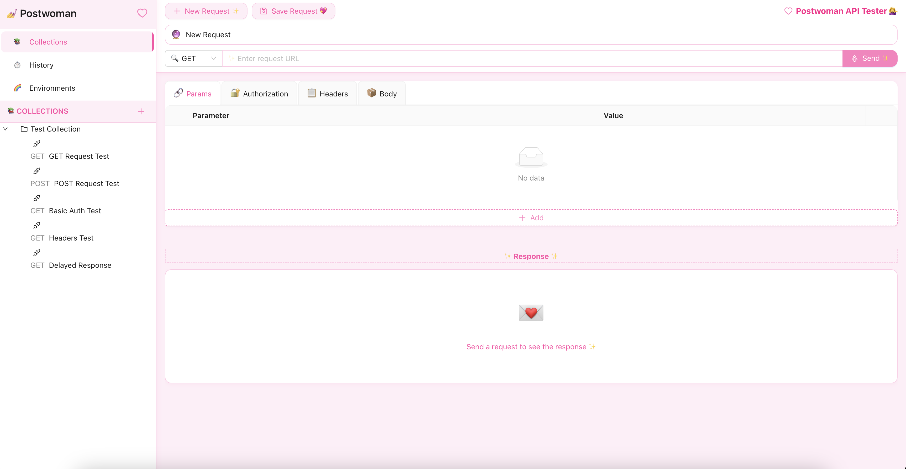

# Postwoman

A lightweight, feature-rich API development environment that simplifies the process of building, testing, and documenting APIs. Built with React and Ant Design, this project is inspired by Postman and provides a clean, intuitive interface for making HTTP requests and analyzing responses.



## Features

### Core API Testing Features
- **HTTP Request Building**
  - Support for all standard HTTP methods (GET, POST, PUT, DELETE, PATCH, OPTIONS, HEAD)
  - URL parameter configuration
  - Custom header management
  - Query parameter editor
  - Multiple body formats (raw JSON, form-data, x-www-form-urlencoded)
  - Syntax highlighting for JSON, XML, and other formats

### Authentication
- **Multiple auth methods supported:**
  - Basic Authentication
  - Bearer Token
  - API Key (header or query parameter)

### Response Handling
- **Rich response visualization**
  - Status code and timing metrics
  - Response headers viewer
  - Formatted JSON viewer with syntax highlighting
  - HTML and XML response formatting

### Workspace Management
- **Collections**
  - Organize requests into collections
  - Save and reuse requests
  - Nested folder structure support
  
- **Environments**
  - Create multiple environments
  - Define and manage environment variables
  - Switch between environments easily

- **History**
  - Automatic request history tracking
  - Quick access to previous requests and responses

## When to Use This Tool

This Postwoman is ideal for:

- **API Developers**: Test and debug APIs during development
- **Frontend Developers**: Verify backend API behavior before integration
- **QA Engineers**: Validate API functionality and performance
- **DevOps Engineers**: Verify deployments and integrations
- **Learning**: Understand HTTP protocols and API structures

Use this tool when:
- You need to test REST APIs without the need for a desktop application
- You want a simple, focused API testing experience
- You're working in environments where installing desktop applications isn't possible
- You prefer a lightweight, open-source alternative to commercial API tools

## Installation

```bash
# Clone the repository
git clone https://github.com/your-username/postwoman.git

# Navigate to the project directory
cd postwoman

# Install dependencies
npm install

# Start the development server
npm start
```

## Usage Guide

### Making a Simple Request

1. Enter a request URL in the URL bar
2. Select the HTTP method (GET, POST, etc.)
3. Click the "Send" button
4. View the response below

### Adding Headers, Params, or Body

1. Use the tabs below the URL bar to access:
   - Query Parameters
   - Headers
   - Authentication
   - Request Body
2. Add your desired configuration
3. Send the request

### Saving Requests to Collections

1. Configure your request
2. Click the "Save" button
3. Enter a request name
4. Select or create a collection
5. Click "Save"

### Managing Environments

1. Select the "Environments" tab in the sidebar
2. Create a new environment
3. Add environment variables
4. Select an environment to use during requests

## Development

### Tech Stack
- **Frontend**: React, TypeScript
- **UI Library**: Ant Design
- **HTTP Client**: Axios
- **State Management**: React Context API
- **Code Editors**: Ace Editor
- **Data Persistence**: localStorage

### Project Structure

```
src/
├── components/       # UI components
│   ├── common/       # Shared UI components
│   ├── request/      # Request-related components
│   ├── response/     # Response visualization components
│   └── sidebar/      # Sidebar, collections, history components
├── store/            # State management
├── types/            # TypeScript interfaces
└── utils/            # Helper functions
```

### Running Tests

```bash
npm test
```

### Building for Production

```bash
npm run build
```

## Contributing

Contributions are welcome! Please feel free to submit a Pull Request.

1. Fork the repository
2. Create your feature branch (`git checkout -b feature/amazing-feature`)
3. Commit your changes (`git commit -m 'Add some amazing feature'`)
4. Push to the branch (`git push origin feature/amazing-feature`)
5. Open a Pull Request

## License

This project is licensed under the MIT License - see the LICENSE file for details.

## Acknowledgments

- Inspired by [Postman](https://www.postman.com/)
- UI design based on Ant Design principles
- Many thanks to all contributors

---


## Default Test Collection

The application comes with a pre-configured "Test Collection" that demonstrates various HTTP capabilities using [httpbin.org](https://httpbin.org/). This collection includes:

1. **GET Request Test**
   - Demonstrates basic GET request with query parameters
   - Endpoint: `https://httpbin.org/get`
   - Shows how query parameters are handled

2. **POST Request Test**
   - Demonstrates POST request with JSON body
   - Endpoint: `https://httpbin.org/post`
   - Shows how to send JSON data in request body

3. **Basic Auth Test**
   - Demonstrates Basic Authentication
   - Endpoint: `https://httpbin.org/basic-auth/user/pass`
   - Shows how to use authentication headers

4. **Headers Test**
   - Demonstrates custom header usage
   - Endpoint: `https://httpbin.org/headers`
   - Shows how custom headers are sent and received

5. **Delayed Response**
   - Demonstrates handling delayed responses
   - Endpoint: `https://httpbin.org/delay/2`
   - Shows loading states and response timing

This test collection serves as both a functionality verification tool and a learning resource for new users.


Made with ❤️ by Bhanu Chaddha